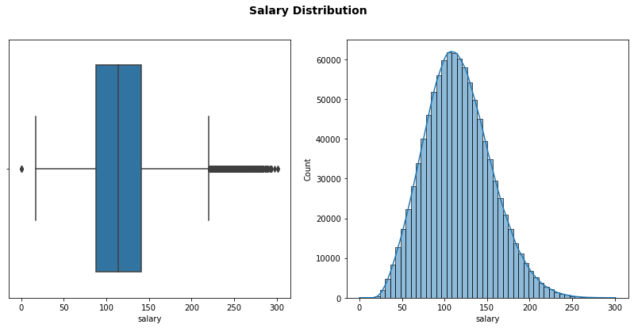

# Salary Prediction
## Table of Contents
* [Problem Overview](#problem-overview-define)
* [Data Exploration](#data-exploration-discover)
    - [First Glance at the Data](#first-glance-at-the-data)
    - [Data Cleaning](#data-cleaning)
    - [Data Visualization](#data-visualization)
    - [Correlation Plots](#correlation-plots)
* [Baseline Model](#baseline-model)
* [Hypothesize](#hypothesize)
    - [Feature Engineering](#feature-engineering)
    - [Estimators](#estimators)
* [Modelling](#modelling-develop)
    - [Create models and tune hyperparameters](#create-models-and-tune-hyperparameters)
    - [Test Models](#test-models)
    - [Selecting the Best Model](#selecting-the-best-model)
* [Running the Models](#running-the-model-deploy)
    - [Automate pipeline](#automate-pipeline)
    - [Deploy Solution](#deploy-solution)
* [References](#references)

## Problem Overview (DEFINE)
The goal of this project is to examine a set of job postings with salaries and then predict salaries for a new set of job postings.

The possible use-case for this project is for the websites showing job postings to give a better estimate of the salaries and to give job seekers an idea about the salaries based on their credentials. Also, this model can be used by HR teams to offer competetive salary to hire and retain employees. 

## Data Exploration (DISCOVER)
### First Glance at the Data
Following datasets are provided for this project in the CSV format:
- `train_features.csv`: As name suggests, this dataset contains the training data in tabular form with all the features. It contains 1 million records and each one of them corresponds to a job listing. All the records contain 8 features which are described as follows:
    
    * `jobId` (str): Unique identifier for each job listing
    
    The following features are the categorical variables in the dataset:
    * `companyId` (str): Categorical variable representing a unique identifier for each company. Total of 63 different companies have their job listings in the dataset
    * `jobType` (str): Examples: CEO, CFO, Manager, etc.
    * `degree` (str): Examples: Bachelors, Masters, Doctoral, etc.
    * `major` (str): Examples: Biology, Engineering, Math, etc.
    * `industry` (str): Examples: Web, Finance, Health, etc.

    There are two numeric features in the dataset:
    * `yearsExperience` (int): Number of years of experience
    * `milesFromMetropolis` (int): Distance between a job's location and nearest metropolis

- `train_salaries.csv`: Dataset containing the target variable (`salary`) for each job listing of the `train_features.csv`.
- `test_features.csv`: The unseen job listings missing the target variable. Our goal is to predict the salary for these 1 million records.

All of this data is available in the data directory (_not included in the repo_). 
The `train_features.csv` and `train_salaries.csv` files are loaded as pandas dataframe and merged together in a single dataframe

### Data Cleaning
There are certain things we want to investigate for data cleaning:
- Presence of any missing or duplicate data
- Check if there is any invalid data i.e. records with negative salaries

These cases need to be pre-precessed (imputation or removal of records) before going into any modelling step. Same procedure is applied to test data as well.

It is found that the data is pretty much clean with no duplicate or missing values. There are, however, 5 training records with zero salary, they are not very interesting to us so we just removed them.

### Data Visualization
> __All the code for the exploratory data analysis is available in the notebook which can be found [here](notebooks/EDA_and_feature_engineering.ipynb).__

Visualization part of the data involves the visualizing the trends and summaries of various features and target variable and to plot their correlation with each other. Let's start with the target variable first:

__1. Target variable: `salary`__



As we can see, salary is slightly right skewed which should not be surprising since there are only a handful of people with very high salaries in a typical salary distribution. Most of the salaries are located in around the range 85-140 with the median value of about 115. Also, the mean and the median values are almost coinciding meaning the distribution is almost symmetrical.

We will explore the numeric features now.

__2. `yearsExperience`__


Apart from relatively small fluctuations, data is almost evenly distributed between the unique values of the `yearsExperience`. There are only 25 unique integer values for this feature, meaning, it might as well be considered as an ordinal categorical variable. We kept it as a numeric variable though since there is a non-zero positive correlation between `salary` and `yearsExperience` as shown by the right plot above.


__3. `milesFromMetropolis`__


Again, we can clearly see that data is pretty much evenly distributed between all the values of `milesFromMetropolis`. Interestingly the salaries decrease as we move farther from the big cities. This might be due to the fact that bigger cities have higher cost of living so the companies there pay you more.

We will continue our analysis with the categorical features now.

__4. `degree`__


The corresponding data table for the target variable for the unique values for this feature looks like:
| degree | mean | count |
| :---: | :---: | :---: |
| BACHELORS | 125.45 | 175495 |
| DOCTORAL	| 135.50 | 175362 |
| HIGH_SCHOOL | 101.92 | 236975 |
| MASTERS | 130.51 | 175310 |
| NONE | 98.176882 | 236853 |

We can easily infer that advanced degrees like Ph.D. and masters indeed help in getting big salaries. There is a category with name `NONE` in this feature. This is probably those records for which the `degree` is not reported.

__5. `jobType`__


Data table:
| jobType | mean | count |
| :---: | :---: | :---: |
| CEO | 145.311425 | 124778 |
| CFO | 135.458547 | 124369 |
| CTO | 135.481067 | 125045 |
| JANITOR | 70.813045 | 124971 |
| JUNIOR | 95.333087 | 124592 |
| MANAGER | 115.368518 | 125120 |
| SENIOR | 105.487775 | 125886 |
| VICE_PRESIDENT | 125.368630 | 125234 |

There is a clear trend of `jobType` with `salary` as CEO, CFO, and CTO are high paying jobs whereas the median salary of junior and janitor level roles is comparatively quite low.

__6. `major`__


| major | mean | count |
| :---: | :---: | :---: |
| BIOLOGY | 127.932664 | 58379 |
| BUSINESS | 135.648980 | 58518 |
| CHEMISTRY | 129.072085 | 58875 |
| COMPSCI | 132.075605 | 58382 |
| ENGINEERING | 138.441342 | 58594 |
| LITERATURE | 124.423097 | 58684 |
| MATH | 133.322042 | 57800 |
| NONE | 102.583864 | 532353 |
| PHYSICS | 130.372436 | 58410 |

Listings with majors like Engineering, Business and Maths have high salaries. There is a category called `None` which probably means either it is not reported or the major is not any of the listed categories.

__7. `industry`__


| industry | mean | count |
| :---: | :---: | :---: |
| AUTO | 109.435222 | 142941 |
| EDUCATION | 99.448386 | 142819 |
| FINANCE | 130.747659 | 142866 |
| HEALTH | 115.735540 | 142755 |
| OIL | 130.953863 | 142770 |
| SERVICE | 104.446820 | 142639 |
| WEB | 121.645362 | 143205 |

The dataset is also almost uniformly distributed between various industries. Oil and Finance sector pay their employees more salaries as compared to other industries.

__8. `companyId`__


The above plot shows the median salaries of all the 63 unique companies. Most of the companies have their median salary of about 114k.

### Correlation Plots
One important step to understand the association of the features with the target is to estimate correlations. We calculated the correlations of the categorical columns by encoding the mean target values grouped by that particular feature and the corresponding correlation plot looks like-


It looks like `jobType` has the biggest correlation with the target followed by `degree`. We will actually use this for our baseline model.

## Baseline Model
For the baseline model, we did not use any machine learning algorithm but rather just used the mean target encoding estimated by grouping by the most correlated features in the training set. We then predicted the `salary` for the validation set using these mean encodings. 

We tried grouping the training data by both `jobType` and `degree` columns separately to predict the target. The corresponding `mean_squared_error` (MSE) looks like:

| Grouped by | MSE |
| :---: | :---: |
| `jobType` | 960 |
| `degree` | ~1030 |

This served as the baseline for us. We will see how with using more sophisticated algorithms as well as hyperparameter tuning we will bring the MSE down to about 300.

## Hypothesize
### Feature Engineering
Feature engineering is a big part of the machine learning workflow. It can lead to the drastic improvements in the performance metrics and it is an essential skill to have. Type of features generated depends a lot on the domain knowledge of the individual and different features can affect differently. This is the place where I spent most of my time on while working on this project. After brain-storming with a couple of ideas, I used the following extra-features along with the original ones:

1. `mean`, `min`, `max`, `std`, `median` of `salary` grouped by all the categorical columns.
2. `mean`, `min`, `max`, `std`, `median` of `yearsExperience` grouped by all the categorical columns.
3. `mean`, `min`, `max`, `std`, `median` of `milesFromMetropolis` grouped by all the categorical columns.

The corresponding correlation plot looks like this:


The following table summarizes the correlation of each feature with target `salary`:
| feature | correlation |
| :---: | :---: |
| `yearsExperience` | 0.375013 |
| `milesFromMetropolis` | -0.297686 |
| `mean_salary` | 0.755125 |
| `max_salary` | 0.587387 |
| `min_salary` | 0.698254 |
| `std_salary` | 0.337293 |
| `median_salary` | 0.744016 |
| `mean_yearsExperience` | 0.113453 |
| `max_yearsExperience` | -0.150344 |
| `min_yearsExperience` | 0.257622 |
| `median_yearsExperience` | 0.102039 |
| `max_milesFromMetropolis` | -0.262282 |
| `min_milesFromMetropolis` | 0.172798 |

As we can see, `mean_salary` and `median_salary` has the largest magnitude of the correlation with target. This should not be surprising because every feature with suffix `_salary` is a result of some aggregate function based on target grouped by all categorical columns.

### Estimators
The three models which we thought would show a great improvement over the baseline model are following:
- [Ridge regression](https://scikit-learn.org/stable/modules/generated/sklearn.linear_model.Ridge.html) - Linear model which uses ordinary least squares with l2-regularization. Since it is a linear model, numeric parameters need to be scaled first before feeding the data into the model
- [Random Forest](https://scikit-learn.org/stable/modules/generated/sklearn.ensemble.RandomForestRegressor.html?highlight=random%20forest#sklearn-ensemble-randomforestregressor) - Tree based method which uses an ensemble of the decision trees and makes predictions based on the majority vote
- [LightGBM](https://lightgbm.readthedocs.io/en/latest/)- A gradient boosting framework which is ultra fast and high performance. It performs almost always better in terms of the results as well as the running time than the estimators listed above

## Modelling (DEVELOP)
### Create models and tune hyperparameters
The three estimators listed were then created and their corresponding hyperparameters were tuned using [optuna](https://optuna.readthedocs.io/en/stable/index.html). The result of the hyperparameter optimization for each estimator is summarized in the following plots:
1. LightGBM

- Effect on objective (mean squared error) due to various hyperparams:


- Hyperparameter importances:


2. Random Forest

- Effect on objective (mean squared error) due to various hyperparams:


- Hyperparameter importances:


3. Ridge Regression

- Effect on objective (mean squared error) due to various hyperparams:


- Hyperparameter importances:


### Test Models
We used five fold cross validation on each of the models with the optimum hyperparameters showed in the above step. The results can be shown in the following table in terms of the mean squared error for each fold:

| Fold | LightGBM | Random Forest | Ridge Regression |
| :---: | :---: | :---: | :---: |
| 1 | 292.36 | 299.98 | 331.89 |
| 2 | 292.03 | 299.67 | 331.86 |
| 3 | 291.82 | 299.02 | 332.38 |
| 4 | 291.31 | 299.24 | 332.10 |
| 5 | 291.03 | 298.63 | 330.74 |
| __Mean__ | 291.71 | 299.31 | 331.79 |

_Although it doesn't look like much difference between the mean sqaured errors of LightGBM and Random forest, these two models differ vastly in terms of the running time. Each fold of LightGBM took around 5 minutes to run whereas random forest took around 1 hour per fold._

> One very important thing that we should note is that all of the engineered features with suffix `_salary` have some information about the target variable `salary`. This poses a big caveat: __although these feature will really help bringing the `mean_squared_error` (MSE) down for the training and validation set but they will result in a poor generalization error__. The model will overfit the validation set but will have a large MSE on the test set. This is called _data leakage_. To see its effect, we analyzed the model performance _with_ and _without_ these columns on 10-fold cross-validation and the results are shown in the following table (results rounded off to the nearest integer):
>
> | mean MSE with `*_salary` features | mean MSE without `*_salary` features |
> | :---: | :---: | 
> | 291 | 355 |
>
> We nevertheless kept these features for the training as well as validation since we don't know how well the model performed on the test set.

### Selecting the best model
It is clear from the above table that LightGBM out-performed all the other models, both in terms of the performance as well as the running time. We will use it as our "production" model.

## Running the model (DEPLOY)
### Automate pipeline
All the optimized hyperparameters for the best model are saved as a [JSON file](models/best_hyperparams_lgbr.json) with the saved model stored as a binary file in the [models](models/) directory. The predictions made by the best model on the test set are also saved in the [models](models/) directory as a [CSV file](models/predictions.csv).

The code for training the model is located in the [src](src/) directory with file name - [main.py](src/main.py). But we need to install all the requirements needed to run the code first. 
To install all the requirements, first create a virtual environment using (on macOS and linux systems only):

```bash
python -m venv <environment_name>
source <environment_name>/bin/activate
```
Once the environment is created and activated, run the following:

```bash
pip install -r requirements.txt
```

Now for running the model, we just need to go to the root directory inside the python environment and run:

```bash
python src/main.py --n_folds 5 --data_dir data --model_dir models --param best_hyperparams_lgbr.json best_hyperparams_rf.json best_hyperparams_ridge.json
```
where:
- `--n_folds`: the number of cross-validation folds
- `--data_dir`: path to the directory containing all the train and test CSV files
- `--model_dir`: path to the output directory. It stores all the saved models, optimized hyperparam JSON files and the predictions
- `--param`: name of all the optimized hyperparameter files for the models used followed by a space between two names.

The hyperparameter tuning file is located [here](src/tuning_hyperparams.py) and can be run by following command (inside the environment):

```bash
python tune_hyperparams.py
```

### Deploy solution
The most important features as far as model performance is concerned are shown in the following plot:


The left panel shows the feature importances for LightGBM model whereas the feature importances for Random forest is shown in the right panel. For the best performing model (LightGBM) the most important feature is `milesFromMetropolis` followed by `std_salary` which shows the dispersion in the salary grouped by all categorical features in the data. As described earlier, all the feature with suffix `*_salary` in their name introduce data leakage in the data and should be avoided.

## References:
1. Optuna documentation: https://optuna.readthedocs.io/en/stable/index.html
2. LightGBM: https://lightgbm.readthedocs.io/en/latest/
3. https://towardsdatascience.com/using-columntransformer-to-combine-data-processing-steps-af383f7d5260
4. https://towardsdatascience.com/https-medium-com-perlitz-hyper-parameter-optimization-with-optuna-1c32785e7df
5. A huge inspiration from DSDJ intermediate notebook on the same project.
